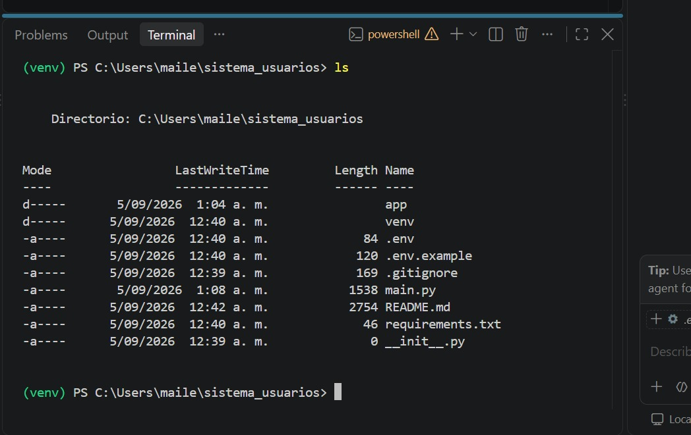
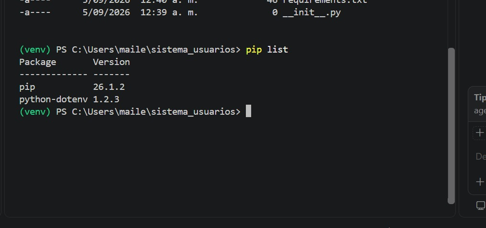
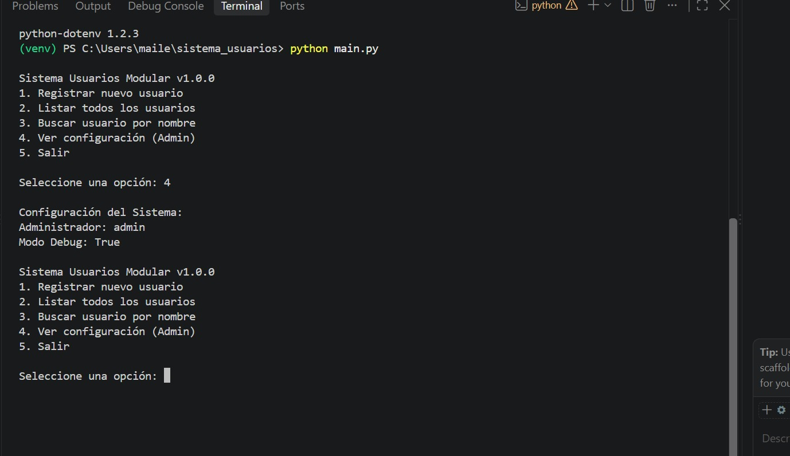

# Sistema Modular de Usuarios

## Descripcion de la aplicacion
Este es un sistema de gestion de usuarios desarrollado en Python que aplica conceptos avanzados de modularizacion, gestion de dependencias y variables de entorno. La aplicacion permite registrar, listar y buscar usuarios a traves de una interfaz de consola, manteniendo una estructura de codigo organizada profesionalmente.

## Estructura Modular
El proyecto esta dividido en paquetes y modulos para separar responsabilidades:
- `app/config/`: Contiene la configuracion global cargada desde variables de entorno.
- `app/usuarios/`: Contiene la logica de negocio (gestor) y validaciones de datos.
- `main.py`: Actua como el punto de entrada y controlador de la interfaz de usuario.

## Requisitos Previos
- Python 3.x instalado.
- Git configurado.

## Instalacion y Configuracion

### 1. Clonar el repositorio
```bash
git clone https://github.com/MMBEGAMBRE/sistema_usuarios.git
cd sistema_usuarios
```

### 2. Crear el entorno virtual
Es fundamental aislar las dependencias del proyecto:
```bash
python -m venv venv
```

### 3. Activar el entorno virtual
- **Windows**: `.\venv\Scripts\activate`
- **Linux/macOS**: `source venv/bin/activate`

### 4. Instalar dependencias
```bash
pip install -r requirements.txt
```

### 5. Configurar variables de entorno
Cree un archivo llamado `.env` en la raiz del proyecto basandose en `.env.example`:
```bash
APP_NAME=Sistema Usuarios
APP_VERSION=1.0
ADMIN_USER=admin
```

## Ejecucion del Proyecto
Para iniciar el sistema, ejecute:
```bash
python main.py
```

## Evidencias de Desarrollo

### 1. Creacion del Entorno Virtual e Instalacion



### 2. Uso de Variables de Entorno


### 3. Ejecucion del Sistema y Validaciones


---

## Reflexion Final (Video)
En el siguiente video se explica detalladamente la importancia de la modularizacion, el aislamiento de dependencias y el uso seguro de variables de entorno:

**Link al video en YouTube**: [TU_LINK_AQUI]

### Puntos clave:
1. **Ventajas de modularizar**: Facilita el mantenimiento, la escalabilidad y las pruebas unitarias.
2. **Aislamiento de dependencias**: Evita conflictos entre diferentes proyectos y garantiza que la app funcione en cualquier entorno.
3. **Seguridad en variables de entorno**: Permite proteger credenciales sensibles (como llaves de API o contraseñas) fuera del codigo fuente y del control de versiones.
